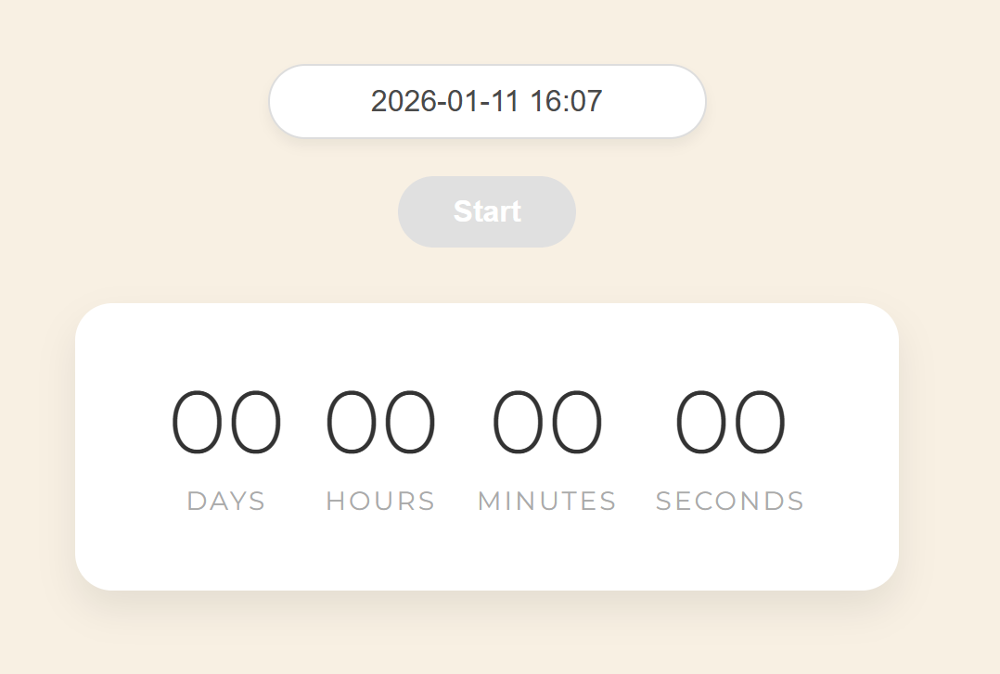
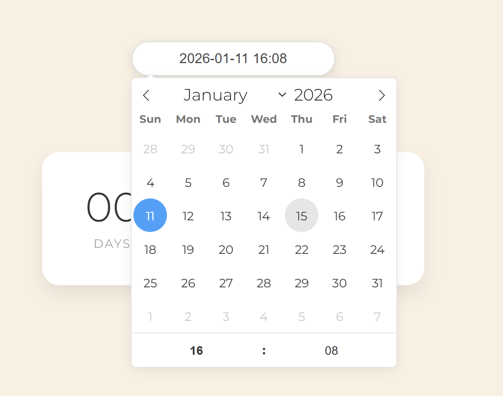
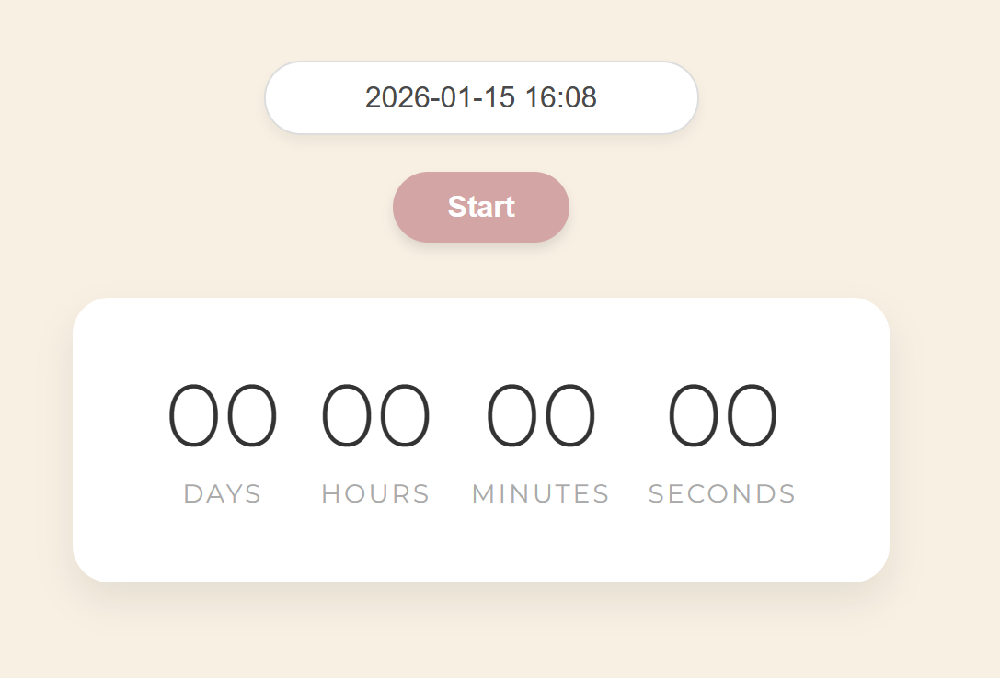
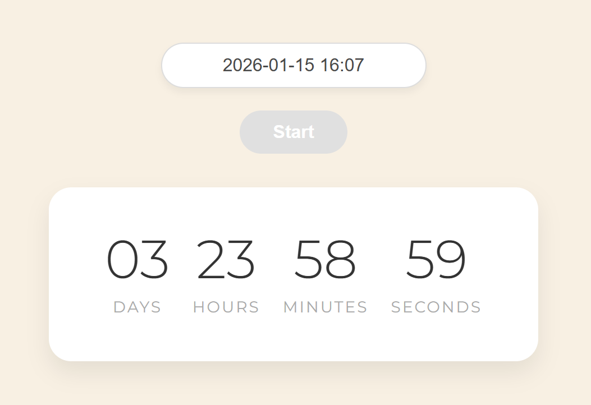

# ⏳ Modern Countdown Timer

A sleek, responsive, and user-friendly countdown timer built with **Vanilla JavaScript** and **Vite**. This project allows users to select a future date and track the remaining time in days, hours, minutes, and seconds.

## 🚀 Features

- **Future Date Selection:** Integrated with `flatpickr` for a smooth calendar experience.

- **Real-time Updates:** Time calculates every second with precise accuracy.

- **Modern Notifications:** Uses `iziToast` for beautiful, non-intrusive error alerts.

- **Responsive Design:** Fully centered and styled with a soft, modern color palette using the Montserrat font.

- **State Management:** The "Start" button and input field are intelligently disabled/enabled based on the timer's state.

## 🛠️ Tech Stack

- **Core:** HTML5, CSS3, JavaScript (ES6+)

- **Bundler:** Vite

- **Libraries:**

  - **[!flatpickr](https://flatpickr.js.org/)** (Date & time picker)

    - **[!iziToast](https://marcelodolza.github.io/iziToast/)** (Elegant notifications)

## 📸 App Preview

|              Main Page               |               Time Picking                |               Ready to Start                |                Countdown                 |
| :----------------------------------: | :---------------------------------------: | :-----------------------------------------: | :--------------------------------------: |
|  |  |  |  |

## 📦 Installation & Setup

1. Clone the repository:

```bash
git clone https://github.com/halenurgurel/countdown-timer.git
```

2. Navigate to the project directory:

```bash
cd countdown-timer
```

3. Install dependencies:

```bash
npm install
```

4. Run the development server:

```bash
npm run dev
```

5. Build for production:

```bash
npm run build
```

## 📝 How It Works

The user selects a date using the input field.

If the date is in the past, an iziToast error appears and the "Start" button remains disabled.

Upon selecting a valid future date, the "Start" button becomes active.

Once started, the setInterval function calculates the difference between the current time and the target date using the convertMs() helper.

The UI updates every second until the countdown reaches zero.

## 👩‍💻 Author

**Halenur Gürel** – Asynchronous JavaScript & UI Library Integration 🚀

**[Live Demo]()** 📍

🔗 **[GitHub Profile](https://github.com/halenurgurel/)**

🎯 “This project demonstrates how to handle complex asynchronous flows, manage local and future time states, and provide a polished user experience through custom-styled UI notifications and interactive elements.”
